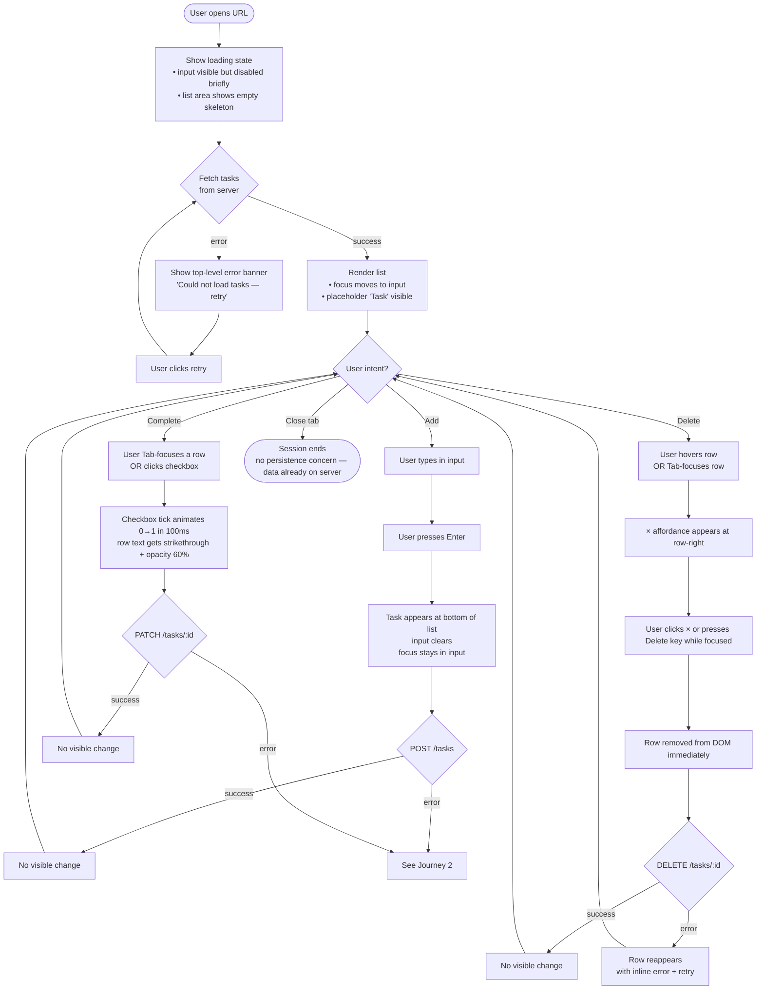
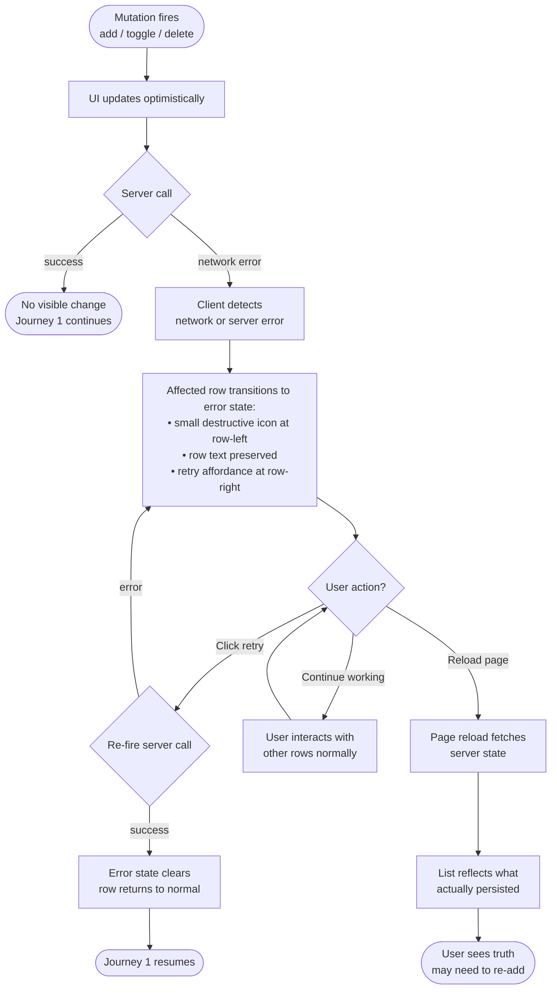
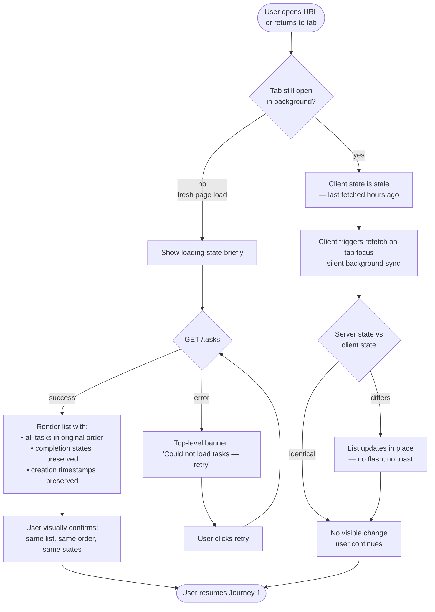

---
stepsCompleted:
  - step-01-init
  - step-02-discovery
  - step-03-core-experience
  - step-04-emotional-response
  - step-05-inspiration
  - step-06-design-system
  - step-07-defining-experience
  - step-08-visual-foundation
  - step-09-design-directions
  - step-10-user-journeys
  - step-11-component-strategy
  - step-12-ux-patterns
  - step-13-responsive-accessibility
  - step-14-complete
workflowStatus: complete
completedAt: 2026-04-23
inputDocuments:
  - _bmad-output/planning-artifacts/prd.md
  - docs/initial-prd.md
  - _bmad-output/planning-artifacts/prd-validation-report.md
---

# UX Design Specification bmad-test

**Author:** Chris
**Date:** 2026-04-23

---

<!-- UX design content will be appended sequentially through collaborative workflow steps -->

## Executive Summary

### Project Vision

A single-user, full-stack todo web application that demonstrates minimalism as a product discipline. The interface is a single list view with a task input, per-row affordances for completion and deletion, and a small set of environmental states (empty, loading, error, offline). "Done" is a design goal — every pixel and interaction exists for a reason, with no accretion features on the horizon.

### Target Users

Single persona: **Chris** — the author, a technically fluent user running the app on his own machine or personal deployment. Uses it to track personal tasks that would otherwise sit in a text file. Keyboard-comfortable. Visits from desktop (primary) and mobile (secondary). Does not want tutorials, onboarding, or handholding. Cares that it is fast, always there, and visually unembarrassing.

### Design System & Foundation

**Component library:** **shadcn/ui**, adopted in its canonical form (path (a) — dependency budget relaxed in the PRD from 5 to 10 production packages to accommodate it).

The stack:
- **Radix UI primitives** — Checkbox, Label, and other accessible primitives as needed. Radix handles focus management, ARIA attributes, keyboard interaction, and state announcement by default, which directly satisfies FR21, FR22, and FR23 without custom work.
- **Tailwind CSS** — utility-first styling, with shadcn's CSS-variable-based theming.
- **shadcn stock utilities** (`class-variance-authority`, `clsx`, `tailwind-merge`) — the canonical composition layer.

**Why this fits the product thesis:** shadcn/ui's default aesthetic — muted, utilitarian, typography-centric, CSS-variable themed — aligns with "visually unembarrassing" without requiring visual design effort. The copy-into-your-project model keeps our source visible and auditable (every component lives in our own repo, not behind a framework import). And the Radix accessibility guarantees buy us FR21–FR23 as a *property of the library*, rather than something we have to prove through testing.

**Trade-off we accepted:** The PRD's original NFR-M1 cap of ≤5 direct production dependencies would have required writing Radix-equivalent primitives by hand. The UX workflow recommended relaxing the cap to ≤10 in exchange for better accessibility and a more defensible styling foundation. The PRD has been updated accordingly.

### Key Design Challenges

1. **"Empty" without being empty.** The PRD explicitly refuses a tutorial, onboarding modal, or CTA in the empty state (FR10). The challenge is designing an empty state that still *invites* task entry without instructing — composition, hierarchy, and focus behavior have to carry the weight that copy would normally carry.

2. **Visual distinction of completion without color-only reliance (FR8, NFR-A4).** Must read as "done" to a user who can't see color. shadcn's default Checkbox provides a native-looking tick; we layer strikethrough plus reduced opacity on the row text so completion is unmistakable visually and semantically.

3. **Inline, persistent per-row error state (Journey 2, FR17).** Needs to be distinct from a dismissable toast, survive for as long as the failure is unresolved, offer a retry affordance — and *not* visually dominate the list so the rest of the list stays usable. This is the single trickiest pattern in the product.

4. **Touch targets on mobile without desktop bloat (NFR-A3).** shadcn's default Radix Checkbox renders at ~16px — below the 44×44 requirement on mobile. We wrap the visible checkbox in a larger invisible hit-target on mobile breakpoints; visually unchanged, functionally compliant.

5. **Keyboard-first operation (FR21).** Tab order, focus ring treatment, Enter-to-submit, Space-to-toggle, Escape behavior on the input — all need explicit design. Radix enforces much of this for free; we design the keyboard map and let Radix handle the plumbing.

### Design Opportunities

1. **Silence as signal.** The product refuses features other todo apps add. The UX leans into this — ample whitespace, one visual center of gravity (the list), typography that does the work a toolbar usually does. Constraint becomes style. shadcn's defaults align with this rather than fighting it.

2. **Keyboard-first as a product statement.** Because the user is technical and the app is simple, a keyboard-driven experience (input always focused on load, Enter to add, Space to toggle, `Cmd+Backspace` or `Delete` to remove the focused row) costs little with Radix as the foundation and communicates "this respects your fluency."

3. **The error row as a craft moment.** Getting the inline failure state right — specific, reassuring, not alarmist — is the single place where this product can feel *better* than most polished todo apps. Most error states are either toasts (dismissable, forgettable) or modal-blocking. A calm inline state with retry is rare and makes the app feel trustworthy.

## Core User Experience

### Defining Experience

The core experience is **adding a task**. Everything else (viewing, completing, deleting) happens less frequently and with less friction. If we nail one interaction, it is this one: open the app, type a task, press Enter. One breath.

The secondary loop is **acknowledging progress** — the moment a user clicks the checkbox and sees the row transition to "done." Small UX weight, outsized emotional payoff. Getting that 100 ms transition right is the difference between "app" and "tool."

### Platform Strategy

- **Web SPA**, single-page, client-rendered, responsive.
- **Primary input on desktop:** keyboard. The user is a developer; the hands stay on the home row.
- **Primary input on mobile:** touch, single column, one-thumb reach.
- **No installable app, no PWA manifest, no offline mode** (per PRD): this is a webpage, not an app-trying-to-be-a-native-app.
- **Deployment assumption:** single origin, any modern browser of the last two major versions.

### Effortless Interactions

These should require zero thought:

1. **Task input is focused on load.** Open the URL → cursor is in the input → start typing. No clicks, no "where do I start," no onboarding.
2. **Enter submits and clears.** After adding a task, the input retains focus and clears itself. The user can add three tasks in rapid succession with no mouse contact.
3. **Space toggles completion on the focused row.** Tab to a task, Space to tick. No hunting for a checkbox with a cursor.
4. **Persistence is invisible.** The user never thinks about "saving." Add a task, close the tab, reopen a week later — it is there.
5. **Failure is legible, not alarming.** When a write fails, the app tells the user *on the exact row that failed*, preserves the text, offers retry. The user knows what happened and what to do, in under a second of attention.

### Critical Success Moments

Four moments determine whether this product feels good or mediocre:

1. **First task, first visit (target: < 10 seconds).** The user opens the app, figures out the input, types a task, sees it appear. If this takes longer than ten seconds or requires reading anything, the product has failed before it started.
2. **The satisfaction of a tick.** The moment a user clicks the checkbox and sees the row transition — crisp, under 100 ms, visually unambiguous. This is the dopamine loop of every todo app; most get it mediocre. Getting it right makes the app feel *good*.
3. **Return-after-time-away.** Opening the app after a week and finding tasks exactly as they were — same order, same states, same text. No "session expired," no reshuffling, no missing items. This is trust, earned silently.
4. **Network hiccup, graceful recovery.** A write fails on spotty wifi. The app shows the failure inline, preserves the text, offers retry. The user realizes nothing was lost. Most todo apps either eat the error or alarm about it; a calm, contextual recovery is where this product can distinguish itself.

### Experience Principles

These guide every UX decision that follows:

1. **Focus is the default.** The user's primary intent on arrival is to add a task. The input has focus, not a modal, not a menu, not a "welcome."
2. **Keyboard equals primary, not alternate.** The keyboard map is designed first, then verified against mouse and touch. Anything that requires a mouse is a design debt worth scrutinizing.
3. **Optimistic by default, honest when wrong.** UI updates happen immediately on user intent. When the server disagrees later, the UI corrects itself visibly and in context — never silently, never with a toast that disappears before the user processes it.
4. **Completion is obvious without color.** Completed tasks are unmistakable to a user who cannot distinguish red from green — strikethrough plus reduced opacity, never color alone.
5. **Silence is a feature.** No notifications, no nudges, no empty-state instructions, no "pro tips." The product trusts the user to know what a todo app is.
6. **Nothing rearranges itself.** Task order is stable — creation timestamp, ascending. No "smart sorting," no "recently completed moves to bottom" animation, no auto-collapse of completed sections. The user's mental model of the list matches what they see, always.

## Desired Emotional Response

### Primary Emotional Goals

One primary feeling, delivered consistently: **quiet confidence**. The user opens the app, does the one or two things they came to do, closes it, forgets about it. The app never makes them feel *anything strong* — no excitement, no delight-moment, no surprise. A utility that earns its place by not demanding attention.

One brief spike is allowed and encouraged: **the small satisfaction of a completed tick**. A checkbox change is a tiny, physical-feeling event — the shortest possible emotional loop. This is the only place the product is permitted to *feel* like anything. Everything else is calm.

### Emotional Journey Mapping

| Stage | Target feeling | Why |
|---|---|---|
| First open | *Oh, it is just there.* | No welcome, no "let me explain." The input is focused, the list is visible, the job begins immediately. |
| Adding a task | *That was fast.* | One field, one keypress, instant appearance. Friction-free enough that the user forgets they "used an app." |
| Completing a task | *Good.* (small, private satisfaction) | The brief dopamine of a tick, nothing more performative than that. |
| Deleting a task | *Gone.* | No confirm modal, no undo toast — just a clean removal. (Undo is explicitly out of scope per PRD.) |
| Return after time away | *Still here.* | Quiet trust. The list is as you left it. |
| Network failure | *OK, that did not save. I know what to do.* | Calm legibility. Not alarming, not apologetic. Just factual. |
| Closing the tab | *(nothing)* | The user does not think about the app after closing it. This is a feature. |

### Micro-Emotions

Most important for this product:

- **Trust** (over skepticism): Earned through persistence, stability of ordering, and never-losing-data. The user's mental model matches the app's state, always.
- **Confidence** (over confusion): The UI offers exactly one clear action at each moment. No hunting, no decisions about what to do next.
- **Calm** (over urgency): No red badges, no "5 tasks remaining!" counts, no notifications, no nudges. The app is patient.

Deliberately *not* pursued:

- **Delight / surprise**: This is a utility, not an entertainment product. Moments of delight are distractions for a user who opened the app to do one specific thing.
- **Accomplishment / pride**: The product does not celebrate you. A completed task is a state, not an achievement. No streaks, no badges, no "you completed X tasks this week!" — these belong to a different kind of product.
- **Belonging / connection**: Single-user app. Nobody to belong with.

### Design Implications

Emotional goal → UX decision:

- **Quiet confidence** → Muted palette, no exclamation marks in copy, no animated icons, no "did you know?" tooltips. The visual tone is below the user's attention threshold by default.
- **Trust through persistence** → Stable sort order (creation timestamp, never reshuffled), no auto-archive of completed tasks, no "task expired after 30 days" cleanup. What the user put in stays where they put it.
- **Small satisfaction of a tick** → Invest in the completion transition: ≤ 100 ms, smooth (not bouncy), strike-through plus opacity dim together. This is the one animation worth getting right.
- **Calm legibility of failure** → Inline error state uses the same type scale as body text — no red-alert icons, no capital letters, no exclamation points. The copy reads like a peer noting a fact, not a system apologizing.
- **No residual attention** → Closing the tab leaves no ambient presence. No Service Worker push permission, no "install this app" banner, no favicon badge counts.

### Emotional Design Principles

1. **Under the attention threshold by default.** The app's job is to disappear between user actions. Visual weight only where the user is actively looking.
2. **Emotion is earned, not manufactured.** The only permitted emotional beat is the completion tick. Don't add celebratory animations, empty-state illustrations, or onboarding confetti to manufacture feeling where none is required.
3. **Failures are legible, not alarming.** Error states communicate at the same emotional register as success states — factual, calm, specific. A network error should feel no more dramatic than a successful save.
4. **The user's mental model is sacred.** If the user expects their tasks to be in the same order, don't resort them. If they expect a completed task to still be there, don't auto-hide. Predictability is the emotional foundation of trust.

## UX Pattern Analysis & Inspiration

### Inspiring Products Analysis

Not "copy these," but "study why they work."

**TodoMVC (the reference implementation).** The canonical single-input-plus-list layout. Input pinned to the top, list below, footer with minimal controls. Every todo app reinvents this layout; the reason it keeps returning is that it is structurally right for the task. We adopt it directly.

**Apple Reminders (baseline native-polish target).** The per-row checkbox-left + text pattern, the brief strikethrough animation on completion, and the restraint around onboarding (none) are all benchmarks. The subtle visual treatment of a completed item — dimmed but still visible, not hidden — is the standard we match.

**Things 3 (premium polish per square millimeter).** Demonstrates that a todo app can feel like a physical object. Hit-target sizing, hover affordances that appear contextually rather than always-on, typography-forward design, no unnecessary chrome. We aim for this density of care, at a fraction of the feature count.

**Linear (row-level failure handling).** Linear's inline-error pattern for failed operations (save failed → the row gets a small indicator, retry is one click, the rest of the list stays interactive) is the right reference for Journey 2 inline error treatment. Calm, specific, non-modal.

**iA Writer (philosophy, not pattern).** Not a todo app, but the correct *emotional* reference. Writing software that disappears so you can think. The typographic restraint, the refusal of UI chrome, the belief that tools should get out of the way — the spiritual benchmark for how this app should *feel*.

**Notion / Todoist (anti-inspiration, studied deliberately).** Both are excellent products that this product must not become. They exemplify feature accretion, right-rail metadata panels, onboarding tours, configurability surfaces, notification systems, and team-collaboration machinery — all things the PRD explicitly refuses. Including them as anti-references is more useful than pretending they don't exist.

### Transferable UX Patterns

**Layout & Composition**

- **Single-column, input-at-top-or-bottom** (TodoMVC, Things, Apple Reminders): The canonical layout. We use input-at-top with the list flowing below, because users who return expect to see recent context before adding new items. Reverses to input-at-bottom on mobile only if thumb reach makes it necessary — a decision for the visual design step.
- **No sidebar, no right rail, no toolbar**: The layout is the list. There are no chrome elements that compete with it.

**Interaction Patterns**

- **Checkbox-left, row-text-center, delete-on-hover-right** (Things, Linear): Checkbox is the primary action and always visible. Delete appears on row hover (desktop) or always-visible at reduced prominence (mobile, since hover doesn't exist). Consistent with user expectation across the category.
- **Optimistic add with Enter-and-clear**: Press Enter → task appears → input clears → cursor stays focused. Same as every good CLI. Makes rapid entry feel weightless.
- **Inline per-row error with retry** (Linear): The affected row gets a compact indicator (small icon + one-line status) with a retry affordance. Everything else stays interactive. We adopt this shape directly.

**Visual Patterns**

- **Strikethrough + opacity reduction** for completed tasks (Apple Reminders, Things): Two visual signals, non-color-dependent, immediately legible. We layer these together.
- **Typography does the work of chrome** (iA Writer, Things): Hierarchy is established through size, weight, and whitespace — not through borders, backgrounds, or dividers. Matches shadcn/ui defaults.
- **Muted color palette with one accent** (Linear, Things): Neutral background, body-text-dark, a single accent color used sparingly (focus rings, the checkbox tick). Most of the UI is black, white, and gray. Matches shadcn's default theming.

### Anti-Patterns to Avoid

Each tied to an emotional or scope principle the product has already committed to:

1. **Onboarding tours, first-run modals, "welcome!" screens** (Notion, most SaaS). Violates the PRD's empty-state constraint and "silence is a feature."
2. **Right-rail or metadata-panel expansion on task click** (Todoist, Notion). The task *is* the text. There is no detail view to expand into.
3. **Unread / pending counts in tab title, favicon, or system notifications**. Violates "under the attention threshold."
4. **Confetti, celebration animations, streak badges on completion**. Manufactures emotion where none is required.
5. **Auto-hide / auto-archive of completed tasks** (Apple Reminders default). Violates "nothing rearranges itself."
6. **Confirmation modal on delete**. Per PRD, undo is explicitly out of scope; the compensating design choice is to make the delete affordance unambiguous, not to add a confirmation friction layer.
7. **Smart sorting, priority inference, "overdue" visual treatment** (Todoist). Priorities, due dates, and AI are refused at the PRD level.
8. **Keyboard-shortcut help overlays, "press ? for shortcuts" hints** (Linear, Superhuman). The keyboard map is discoverable by convention and too small to justify an overlay.

### Design Inspiration Strategy

**Adopt (take directly):**
- TodoMVC layout (input + list)
- Apple Reminders / Things per-row interaction anatomy (checkbox-left, delete-hover-right)
- Apple Reminders completion visual treatment (strikethrough + dim)
- Linear inline row-level error pattern
- iA Writer / Things typographic restraint
- shadcn/ui default muted palette and single-accent scheme

**Adapt (take the pattern, adjust for this product):**
- Things delete-on-hover becomes *delete-always-visible-at-reduced-prominence on mobile* (touch has no hover)
- Linear error row uses shadcn's default neutral palette rather than Linear's specific colors
- TodoMVC footer (filters, counts) is **dropped entirely** — we have no filter states and no pending count display

**Avoid:** the explicit anti-pattern list above. Reviewed at each visual-design decision — if a proposed treatment matches one of those, it is rejected.

## Design System Foundation

### Design System Choice

**shadcn/ui, adopted in canonical form (path (a) from the Design System & Foundation section).**

This decision was made in Step 2 at Chris's explicit direction and is recorded here as the committed foundation. We are not re-opening it.

### Rationale for Selection

Selected over three alternatives that were considered and rejected:

- **Custom design system from scratch.** Rejected: contradicts the PRD's anti-over-engineering principle for a five-endpoint app. The effort of writing hand-rolled accessible primitives would dominate the product's ~1-day implementation budget.
- **Established monolithic system (Material UI, Ant Design, Chakra).** Rejected: these bring a large runtime footprint (~200KB+ gzipped) that breaks NFR-P5 (100KB bundle cap), and their opinionated aesthetic (Material shadows, Ant enterprise density, Chakra defaults) fights rather than supports the product's minimalist thesis.
- **Radix-only without shadcn scaffolding.** Considered as path (c): rejected because we would duplicate the utility work shadcn has already done, with no real benefit for a project of this size.

**Why shadcn/ui wins:**

1. **Accessibility is a property of the library, not a test burden.** Radix primitives handle FR21 (keyboard), FR22 (labels), and FR23 (state announcements) by default. We design the keyboard map and trust the plumbing.
2. **Aesthetic alignment.** shadcn's defaults — muted palette, typography-forward, CSS-variable themed — match the emotional goal of quiet confidence without visual design effort.
3. **Copy-into-your-project model.** Every component lives in our repository, auditable and modifiable. No black-box behavior, no framework-version-lock-in.
4. **Bundle footprint is tractable.** Radix primitives are individually tree-shakable; we only ship what we use (Checkbox, Label, likely Slot). Realistic gzipped frontend bundle is ~30–50KB including React — well inside NFR-P5's 100KB budget.
5. **It composes with Tailwind, which the team already expects to use for styling.** No parallel styling systems, no style-library overlap.

### Implementation Approach

- **Install shadcn/ui via its CLI** (`npx shadcn@latest init`) to scaffold the canonical structure.
- **Add only the primitives we need:** Checkbox, Label. Input as a native element or shadcn's thin wrapper. Button sparingly — only if it offers a clear a11y or focus-ring win over a styled `<button>`.
- **Theme via CSS variables** (shadcn's default mechanism). Define one light-mode theme with:
  - Neutral base scale (gray-50 through gray-900)
  - One accent color for focus rings and checkbox tick fill (finalized in visual design; leaning toward muted indigo or warm neutral)
  - Standard shadcn radius tokens (sm, md)
  - Standard shadcn spacing scale (derived from Tailwind's)
- **No dark mode for v1.** Not a PRD requirement; deferred per "done is a design goal."
- **Do not add features to components.** shadcn components are designed minimal. Resist adding tooltip triggers, context menus, or compound patterns we don't need.

### Customization Strategy

- **Palette:** Replace shadcn's default charcoal with a slightly warmer neutral to match "under the attention threshold." Exact values finalized in visual design.
- **Typography:** Override shadcn's default (Inter) with a single, carefully chosen stack — likely `Inter` or the system UI stack for zero-font-loading-time. Finalized in visual design.
- **Spacing density:** shadcn's defaults are slightly enterprise-dense. Increase vertical rhythm by one Tailwind step on list rows for breathing room consistent with "silence is a feature."
- **Focus ring:** shadcn's default is a 2px accent ring offset. We keep it — accessibility-correct and visually crisp at this scale.
- **Component-level overrides:** The per-row error state is a *new composed component* built on top of shadcn primitives, not a shadcn modification. It is new code, layered in our own file.

## 2. Core User Experience

### 2.1 Defining Experience

**The defining experience for this product is adding a task.** Not CRUD in aggregate — adding specifically. If asked "What does this product do?", the answer is: *you type a task, press Enter, it is there.*

Complete and delete are important, but they are downstream of the core act. Completion is the emotional payoff; deletion is the cleanup. The gesture that *is* the product — the one the user repeats a hundred times — is typing something into an input and pressing Enter.

Every UX decision in this document is evaluated against the question: *does this make adding a task faster, more instant, more frictionless?* If yes, adopt. If no, reconsider.

### 2.2 User Mental Model

The user brings the mental model of a **text file**. Tasks are lines. Adding a task is adding a line. Checking off a task is crossing out a line. The list is the list; there is no underlying complexity.

Key implications:

- **Order is append-only.** Users expect new tasks to appear at the bottom (or top — consistent, in any case) of what they already have, not sorted by magic.
- **There is no "project," no "context," no "workspace."** The list is the whole universe.
- **State is the state.** If a task is on the list, it is on the list. There is no archive, no hidden-because-completed, no soft-delete.
- **Input is text-field shaped.** Users expect to press Enter to commit. Since tasks are single-line by design, we treat Enter as commit and ignore Shift+Enter — no multiline editing for tasks.

**Current solutions users put up with:**

- Native notes apps (Apple Notes, a `.txt` file on the desktop) — no structure, no persistence guarantees across devices, but *no friction*. The bar we match.
- Feature-heavy todo apps (Todoist, Things, Notion) — users put up with the complexity because persistence and sync are good. We offer the persistence without the complexity surcharge.

**Where existing solutions frustrate:**

- Modal or sheet-based task entry (some native apps): opening a sheet to add a task is too much ceremony.
- Focus not in the input by default: users have to click into a field before typing.
- Auto-added metadata (tags, deadlines, defaults): the user didn't ask for these and now has to clear them.

We differentiate by *not doing any of that*.

### 2.3 Success Criteria

The core add-a-task interaction is successful when:

1. **Time from URL-open to first-task-typed is under 3 seconds** — the user does not have to orient, choose, or click before starting to type.
2. **A task appears in the list in under 100 ms after Enter** — feels instantaneous, not "optimistic with loading spinner."
3. **The input is empty and focused after submission**, ready to accept the next task without user intervention.
4. **Zero visual chrome is needed to know what to do** — the input has a placeholder, the list is visible, and nothing else competes for attention.
5. **The user can add 5 tasks in 10 seconds** with a keyboard, without the UI fighting back (no animation queues, no debounced submits, no loading state blocking subsequent typing).

If any of these five conditions fails, the experience has failed.

### 2.4 Novel UX Patterns

**This is a deeply established pattern. No innovation required.** Text input + Enter-to-submit + append-to-list is the canonical pattern, invented roughly by the UNIX shell and rediscovered by every todo app since.

**What we do not innovate on:**

- The input element itself (it is an `<input type="text">`)
- The submit gesture (Enter)
- The list rendering (ordered by creation, visible as-is)

**What we do with care (not innovation, but craft):**

- **The 100 ms transition between Enter and task-appearing.** Most apps fudge this — they show a spinner, they animate in, they wait for server confirmation. We use optimistic UI: the task appears instantly, then the server call happens in the background. If it fails, the row transitions to an error state. If it succeeds, nothing visible changes.
- **The input's always-focused state.** Most apps put focus in the input on initial load, then lose it after the first interaction. We keep focus in the input across every mutation.
- **The placeholder copy.** No "What needs to get done?" — too cute. No "Add a task..." — too instructional. Either a single word (`Task`) or an empty placeholder with the input's shape carrying the invitation. Final call in visual design.

### 2.5 Experience Mechanics

The detailed step-by-step for adding a task:

**1. Initiation**

- App opens. The input field is at the top of the main column, visible without scrolling.
- Focus is already in the input (autofocus on page load). The cursor is blinking.
- The user begins typing. They have performed zero intentional actions; the product has invited input passively.

**2. Interaction**

- User types characters. Input renders them in real-time (standard browser input behavior).
- Input respects the character cap defined in **FR5 (200 characters)**. Past 200, the input stops accepting characters. We do *not* show a character count by default — that is clutter. We *do* subtly indicate "over limit" if the user pastes longer text, via a one-line inline notice that auto-clears on next keystroke.
- User presses **Enter** to commit.
- User can also press **Escape** to abandon the in-progress text and clear the input.

**3. Feedback**

- On Enter, the following sequence happens within a single animation frame (~16 ms):
  1. The new task is added to the bottom of the list, rendered optimistically.
  2. The input field clears.
  3. Focus remains in the input.
- The server call happens asynchronously. While the call is in flight, the row shows *no* loading state (per NFR-P3).
- On server success: no visible change (the row was already there).
- On server failure: the row transitions to the inline error state (see Journey 2 / FR16–FR19). The text is preserved; retry is one click. The rest of the list stays interactive.

**4. Completion**

- The user has added a task. The cursor is in an empty input, ready for the next.
- There is no "done" state for this interaction. Adding a task is not a goal to be completed — it is a gesture to be repeated.
- The user can now:
  - Add another task (same mechanics)
  - Tab out of the input to interact with the list (toggle completion, delete)
  - Close the tab; the task is persisted

## Visual Design Foundation

### Color System

A neutral-heavy palette with one accent. No decorative color anywhere. Exact values are shadcn-compatible CSS variables using `oklch`.

**Base neutral scale (slate-warm):**

```css
--background: oklch(1 0 0);             /* pure white */
--foreground: oklch(0.145 0 0);         /* near-black body text */
--muted: oklch(0.97 0 0);               /* empty-state background, subtle */
--muted-foreground: oklch(0.55 0 0);    /* placeholder, secondary text */
--border: oklch(0.92 0 0);              /* hairline borders, row dividers */
--input: oklch(0.92 0 0);               /* input border */
```

**Single accent (muted indigo):**

```css
--primary: oklch(0.54 0.20 275);        /* checkbox tick fill, focus ring */
--primary-foreground: oklch(0.98 0 0);  /* tick icon color on filled checkbox */
--ring: oklch(0.54 0.20 275);           /* 2px focus ring, same as primary */
```

**Destructive / error (muted red, used only for failed writes):**

```css
--destructive: oklch(0.57 0.21 25);     /* inline error indicator, retry button */
--destructive-foreground: oklch(0.98 0 0);
```

**Rationale for the palette:**

- **Neutrals dominate.** Most pixels are white or near-black; the UI is essentially a typography exercise with one subtle accent. Matches "under the attention threshold" and shadcn's default tone.
- **Accent is muted indigo, not saturated.** A pure primary blue would read as "Material Design" or "generic SaaS." The muted indigo at `oklch(0.54 0.20 275)` is visible without being loud.
- **Destructive is a muted red, used narrowly.** Never as the delete button's default color (delete is neutral). Reserved for the inline error row indicator and retry button.
- **No success, info, or warning colors.** The product has no system notifications, no toasts, no alerts beyond inline row failures. Semantic colors for states that don't exist would be clutter.

**Contrast validation (NFR-A1):**

| Pair | Ratio | Passes |
|---|---|---|
| foreground on background | ~16:1 | ✓ AAA |
| muted-foreground on background | ~4.9:1 | ✓ AA |
| primary on background | ~4.6:1 | ✓ AA |
| destructive on background | ~4.6:1 | ✓ AA |
| primary ring on background | ~4.6:1 | ✓ AA (3:1 required for non-text) |

All text pairs clear AA. Interactive-element contrast clears 3:1. No dark-mode pass for v1.

### Typography System

**One font, one weight scale, one size scale.** Typographic minimalism matches product minimalism.

**Font family:**

```css
font-family: ui-sans-serif, system-ui, -apple-system, BlinkMacSystemFont,
             "Segoe UI", Roboto, "Helvetica Neue", Arial, sans-serif;
```

**Why system stack rather than Inter:** Zero network request, zero font-loading time (supports NFR-P1 < 1000 ms first paint). System fonts look native per platform. This app has no brand to express through type.

**Weights used:**

- **400 regular** — body text, list rows, placeholder
- **500 medium** — input value while typing, completed-task hover state (if needed)

No bold, no italic, no small caps. One axis of contrast.

**Type scale:**

| Role | Size | Line height | Where it appears |
|---|---|---|---|
| Body | 16px | 1.5 | Task rows, input, all primary content |
| Small | 14px | 1.4 | Inline error notice copy, "over limit" indicator |
| Title (reserved) | 24px | 1.25 | *Only if* a page title is added; likely unused |

**Rationale:**

- **16 px body is the default browser size.** Overriding it would be self-indulgent.
- **Line height 1.5 on body** gives reading rhythm without wasting vertical space on a list view.
- **No H1/H2/H3 hierarchy in practice.** The document has no title, no section headers, no meta.

### Spacing & Layout Foundation

**Base unit:** 4px (Tailwind default). All spacing derives from this unit.

**Spacing scale used (Tailwind tokens):**

- `gap-2` (8px) — between list rows
- `p-3` (12px) — inside input vertical padding
- `p-4` (16px) — inside input horizontal padding, page horizontal padding on mobile
- `p-8` (32px) — page horizontal padding on desktop
- `mt-8` / `mb-8` (32px) — vertical separation between input and list

**Layout:**

- **Single column, center-aligned.** Max-width: `600px`, horizontally centered in the viewport.
- **Vertical structure on desktop (≥ 768px):**
  1. Generous top padding (`pt-16` = 64px).
  2. Input, full-width within the 600px container.
  3. 32px gap.
  4. List, full-width within the same container.
- **Vertical structure on mobile (< 768px):**
  1. Shorter top padding (`pt-8` = 32px).
  2. Input, full-width.
  3. 24px gap.
  4. List, full-width.
- **Row height for tasks:** 44px minimum (meets 44×44 touch target per NFR-A1).
- **No borders around rows.** Separation is by whitespace (8px gap). Revisit if wrapping tasks lose visual grouping in user testing.

**Layout principles:**

1. **One focal area per viewport.** The user's eye should land on either the input or the list, never compete.
2. **Whitespace is structural, not decorative.** Breathing room around the single column exists so the app does not feel cramped on a wide monitor.
3. **No horizontal scrolling at any viewport in [320px, 1920px].**

### Accessibility Considerations

- **Focus ring is visible at 2px offset on every interactive element.** Default shadcn `focus-visible:ring-2 focus-visible:ring-ring focus-visible:ring-offset-2`. Never hide focus indicators.
- **Completed-task visual treatment uses two non-color signals:** strikethrough on the text *and* opacity reduction to ~60%.
- **Error state uses one non-color signal in addition to the destructive color:** a small icon (exclamation in a circle) prepended to the inline message.
- **Minimum tap target 44×44 px** enforced via row height and explicit hit-area padding on the checkbox (visible Radix Checkbox at 16 px wrapped in a `p-3.5` container for a 44×44 clickable area).
- **No reliance on hover for core affordances.** Delete button on desktop may reveal on hover, but a keyboard-focused row must also show the delete affordance.

## Design Direction Decision

### Design Directions Explored

The design system (shadcn/ui), color palette, typography, and layout are locked from earlier steps. Generating 6–8 distinct mockup directions would produce artificial difference. Instead, the table below enumerates the real decision points where thoughtful designers diverge in minimalist todo apps, with a committed call on each.

| Axis | Options | Decision |
|---|---|---|
| **Input position** | (a) Top, fixed · (b) Top, scroll-with-page · (c) Bottom | **(a) Top, fixed above list on desktop; top, scroll-with-page on mobile.** Pinned input on desktop preserves one-gesture access while users scan history; mobile keeps it inline so the keyboard does not fight the sticky positioning. |
| **Sort order** | (a) Newest at top · (b) Newest at bottom · (c) Completed at bottom | **(b) Newest at bottom, strict creation-timestamp ascending.** Matches a text-file append model (user's mental model per Step 2.2). Completed tasks stay where they were created — *never* auto-sorted to a bottom section. |
| **Row density** | (a) Tight (36 px) · (b) Medium (44 px) · (c) Loose (56 px) | **(b) Medium (44 px).** Exactly meets the 44×44 touch target; feels breathable without consuming a mobile viewport in 4 rows. |
| **Row separation** | (a) Whitespace only · (b) Hairline divider · (c) Card-style container | **(a) Whitespace only** (8 px gap between rows). Hairlines add visual noise; card containers are too formal. Empty air is the separator. |
| **Delete affordance (desktop)** | (a) Always visible · (b) Hover-reveal · (c) Focus-reveal only | **(b) Hover-reveal on desktop, always-visible on mobile.** Keyboard focus also reveals the delete for a11y parity. |
| **Delete affordance style** | (a) Text "Delete" · (b) Trash icon · (c) × symbol | **(c) × symbol** (lucide `X`), neutral foreground color, appears row-right when revealed. Minimal width, not alarming. |
| **Checkbox style** | (a) Square filled · (b) Circle filled · (c) Outline only | **(a) Square, shadcn default.** Filled on checked with primary accent. Square signals "list item state" more conventionally than circle. |
| **Completion animation** | (a) None · (b) Crossfade ≤ 100 ms · (c) Strikethrough draws across | **(b) Crossfade on checkbox tick + instant strikethrough on text.** Tick scales 0 → 1 in ~100 ms; strikethrough applies immediately. |
| **Empty state** | (a) Completely blank · (b) Faint text above input · (c) Placeholder inside input only | **(c) Placeholder inside input only.** Per FR10, no tutorial/onboarding/CTA. A single-word placeholder (`Task`) inside the input is the minimum viable invitation. |
| **Error state indicator** | (a) Icon + text on affected row · (b) Banner above list · (c) Toast | **(a) Icon + text on affected row** (Linear-style). No banner, no toast. |

### Chosen Direction

**"Apple Reminders polished to Things-level craft, with Linear's inline error handling."**

A single fixed-width column (max 600 px), centered. System-font typography, neutral palette, muted-indigo accent used only for focus and the checkbox tick. New tasks append to the bottom of the list. Completed tasks remain in place, visually dimmed but not hidden. Row hover on desktop reveals a compact `×` delete affordance on the right. Failed writes show inline on the affected row with a retry control. Empty state is a single-word placeholder in the input; everything below is whitespace.

### Design Rationale

- **Honors every principle established in earlier steps.** Focus in input by default, keyboard-first, optimistic with inline error, non-color completion, silence as default, never rearranges.
- **Zero novel UX patterns.** Every decision is borrowed from Apple Reminders, Things 3, TodoMVC, or Linear. The user arrives pre-trained.
- **Implementation-friendly.** Every decision maps cleanly to shadcn/ui primitives plus Tailwind classes. No custom animations beyond a CSS checkbox crossfade.
- **Tests the product thesis.** The decisions above — whitespace-only separation, no hairlines, no card containers, no celebrate animations, no empty-state illustration — are what "minimalism executed with discipline" *looks like* operationalized.

### Implementation Approach

- **No HTML mockup showcase generated for this step.** Rationale: (1) the product surface is small enough that 6-8 visually distinct variations would produce artificial difference, (2) the visual foundation is already locked at a value-level, (3) this is a test-bed where a day-long visual exploration would dominate the build budget.
- **A single annotated mockup is worth generating later** — at the Component Strategy or UX Patterns step, where it illustrates the error-state row and hover-reveal behavior that are harder to communicate in prose.
- **Desktop and mobile share the same layout and same DOM**; mobile simply collapses paddings and the hover-reveal falls back to always-visible via media query.

## User Journey Flows

The PRD documents *who/why* for three user journeys. This step designs the *how* — the mechanics of each flow, including decision branches, error-recovery paths, and the specific UI states the user encounters.

### Journey 1 — Happy Path: Add, Complete, Delete

**Entry point:** User opens the app URL in a browser. No authentication, no loading screen beyond initial data fetch.



**Key mechanics:**

- **Focus management:** Input receives focus on mount. After adding a task, focus remains in the input. Tabbing out of the input enters the list; Shift+Tab from the first row returns to the input.
- **Optimistic updates:** All three mutations (add, toggle, delete) render to the UI first, then fire the server call in the background. A failed server call rolls the UI back to the inline-error state (Journey 2).
- **No confirmation dialogs.** Delete is instant. This is supported by the explicit PRD decision that undo is out of scope — the compensating design is making the × affordance visually unambiguous and positionally consistent (always row-right).

### Journey 2 — Network Interruption Mid-Write

**Entry point:** Any Journey 1 mutation (add / toggle / delete) whose server call fails.



**Key mechanics:**

- **Per-row error state, not global.** The rest of the list stays fully interactive. The user can add another task while one is in a failed state.
- **Error indicator style:** one small lucide `AlertCircle` icon in `--destructive` color at row-left. Retry is a compact `Retry` button (shadcn `Button` variant="ghost" size="sm") at row-right. No capitalized text, no exclamation marks.
- **Idempotency guarantee (NFR-R3):** Retry re-sends the same request with the same client-generated ID. Server de-duplicates. A double-retry cannot produce two rows.
- **Offline detection (FR20):** If `navigator.onLine` is false when a write fires, the client skips the optimistic rollback and shows a page-level "Offline — changes will sync when you reconnect" banner. On reconnect, queued writes flush in order.

### Journey 3 — Return After Time Away

**Entry point:** User navigates to the app URL or switches back to an open browser tab.



**Key mechanics:**

- **No "session expired" concept.** The app has no session state. Opening the URL is always the same experience regardless of time since last visit.
- **Tab-focus refetch is silent.** If the user switches back to a tab that has been in the background for hours, the client silently refetches and reconciles. No spinner, no toast, no "refreshing…" indicator.
- **Sort order is strictly creation-timestamp ascending (FR9).** No reshuffling, no "recently used" sorting, no smart ordering.
- **Data loss is zero (NFR-R1).** If the server has the data, the client renders it. If the network fails on reload, the retry flow handles it.

### Journey Patterns

**Feedback patterns**

- **Optimistic + silent on success, visible on failure.** Every mutation takes effect in the UI first. If the server confirms, nothing else happens. If the server rejects, the affected element transitions to an inline error state with retry.
- **No toasts.** Anything worth telling the user is either inline on the affected element or in a persistent page-level banner for full-page failures.
- **No confirmation dialogs.** Destructive actions execute immediately. Compensation is visual clarity of the affordance, not a friction layer.

**Decision patterns**

- **Per-row failure over global failure.** Global banners are reserved for whole-page failures only (initial list load, offline state).
- **Preserve input over silent discard.** On a failed write, typed content is preserved either in the failed row or in the input field. Never discarded without acknowledgment.

**Navigation patterns**

- **There is only one screen.** No routes, no modals, no overlays. Permanent per PRD scope.
- **Focus as navigation.** Tab order: input → row 1 → row 2 → … → end of list. Shift+Tab reverses. Within a focused row, Space toggles completion, Delete removes.

### Flow Optimization Principles

1. **Minimize steps to value.** Users should never be more than one gesture from their primary intent.
2. **Fail loudly, locally.** The user knows which thing broke and what to do. Never a vague "something went wrong" banner.
3. **Succeed silently.** The absence of error IS the success signal.
4. **Never lose user content.** On any failure path, text the user typed is preserved. Retry is one click away. Reload is always safe.
5. **No invisible state transitions.** Every state change produces a visible UI change within 100 ms.

## Component Strategy

### Design System Components

The product uses a deliberately small set of shadcn/ui primitives. Everything else is composed from these or written directly.

| Component | Source | Usage |
|---|---|---|
| **Input** | shadcn/ui (thin wrapper over native `<input>`) | Task entry field at the top of the page |
| **Checkbox** | shadcn/ui (Radix primitive under the hood) | Completion toggle on each task row |
| **Button** | shadcn/ui | Retry button in inline error state; Retry button on page-level error banner |
| **Label** | shadcn/ui (Radix primitive) | Visually-hidden label on the task input for screen readers |

No other shadcn components are adopted. Specifically *not* used:

- **Dialog / AlertDialog / Sheet** — the product has no modals.
- **Toast / Sonner** — explicit anti-pattern.
- **Dropdown / Popover / Tooltip / HoverCard** — no overlays, no menus, no tooltips.
- **Card / Separator** — whitespace-only separation; no card treatment.
- **Select / Combobox / Command / Calendar / DatePicker** — no filters, tags, or dates.
- **Tabs / Accordion / Collapsible** — one screen, no hidden content.
- **Avatar / Badge** — single-user; no identity display.
- **Form / Textarea / RadioGroup / Switch / Slider** — no forms beyond the task input.
- **Table / Pagination** — task list renders as `<ul>`.
- **NavigationMenu / Breadcrumb** — there is no navigation.

### Custom Components

Five composed components, built in our own code on top of shadcn primitives.

#### TaskInput

**Purpose:** The single-field text input at the top of the page. The defining interaction surface of the product.

**Anatomy:** Wraps shadcn `Input`. Contains a visually-hidden `Label` ("Add a task") for screen readers. Full-width within the 600 px container; 44 px minimum height.

**States:**
- **Default:** empty, placeholder `Task` visible, cursor blinking (autofocused on page mount)
- **Typing:** user value rendered, placeholder hidden
- **Over-limit:** user has pasted or otherwise exceeded 200 characters; inline one-line notice below input (`Up to 200 characters`). Clears on next keystroke or blur.
- **Submitting:** not rendered — optimistic UI clears input immediately on Enter.

**Interaction:**
- **Enter** — submit task, clear input, retain focus
- **Escape** — clear input, retain focus
- **Shift+Enter** — ignored (no multi-line tasks)
- **Tab** — leave input, focus first task row

**Accessibility:** `aria-label="Add a task"`, autofocus on mount, focus ring on `focus-visible`, `maxLength={200}`.

#### TaskList

**Purpose:** Renders the list of tasks. Handles keyboard navigation, loading state, and the `aria-live` region.

**Anatomy:** Semantic `<ul>` with `role="list"`, `aria-live="polite"`, `aria-label="Tasks"`. Renders one `TaskRow` per task, sorted by creation timestamp ascending.

**States:**
- **Loading (initial fetch):** 3 skeleton rows (`animate-pulse` + `bg-muted`), `aria-hidden="true"`
- **Empty:** renders nothing (per FR10, placeholder in `TaskInput` is the only invitation)
- **Populated:** one `TaskRow` per task
- **Load-failed:** not rendered; `PageBanner` shown instead

**Interaction:** Down/Up arrows move focus between rows; Tab also moves forward.

**Accessibility:** `aria-live="polite"` for state-change announcements; stable `key` per row.

#### TaskRow

**Purpose:** A single task in the list.

**Anatomy (left-to-right):**
1. **Checkbox** — shadcn `Checkbox` in `p-3.5` container for 44×44 hit area
2. **Task text** — single line, truncates with ellipsis, `title` attribute for full text
3. **Delete affordance** (`×`) — hover-reveal on desktop, always-visible on mobile, keyboard-focus-reveal always

**States:**
- **Default (active):** checkbox unchecked, text in `--foreground`
- **Default (completed):** checkbox checked with primary-accent tick, text `line-through` + `opacity-60`
- **Hover (desktop):** delete `×` reveals at row-right
- **Focused (keyboard):** focus ring on `<li>` via `focus-within`, delete `×` reveals
- **Error:** see `TaskRowError` below

**Interaction:**
- **Click checkbox / Space (focused):** toggle completion
- **Click ×:** delete
- **Delete or Backspace (row focused):** delete
- **Click on text:** no-op

**Accessibility:** Checkbox `aria-labelledby` → task text; delete `aria-label="Delete task: {text}"`; focus ring via `focus-within`.

#### TaskRowError (variant of TaskRow)

**Purpose:** Inline per-row error state. Not a separate component — a composed variant of `TaskRow`.

**Anatomy:** Prepends `lucide-react` `AlertCircle` at row-left in `--destructive` color. Appends a `Button variant="ghost" size="sm"` labeled `Retry` at row-right (replacing `×`).

**States (within error):**
- **Failed add:** retry re-fires POST with client-generated ID
- **Failed toggle:** retry re-fires PATCH
- **Failed delete:** row reappears; retry re-fires DELETE

**Interaction:** Click Retry (or Enter while focused) re-fires the original mutation with the original idempotency key.

**Accessibility:** Icon `role="img" aria-label="Save failed"`; retry `aria-label="Retry saving task: {text}"`; parent `aria-live` announces transition.

#### PageBanner

**Purpose:** Whole-page status messaging. Used in exactly two scenarios: initial load failure, and offline state.

**Anatomy:** Rendered above `TaskInput` when active. Horizontal strip: icon + one-line message + optional Retry button. Full-width within 600 px container.

**Variants:**
- **Load failed:** `AlertCircle` + `Could not load tasks.` + `Retry`
- **Offline:** `WifiOff` + `Offline — changes will sync when you reconnect.` (no button; recovery is automatic)

**States:** shown when condition active, hidden when cleared. 200 ms fade in, 100 ms fade out.

**Accessibility:** `role="alert"` + `aria-live="assertive"` — immediate announcement of conditions the user needs to know about now.

### Component Implementation Strategy

- **One file per component** in `src/components/`; shadcn primitives in `src/components/ui/` per shadcn convention.
- **No design-system wrapper layer.** Custom components import shadcn primitives directly.
- **Styling via Tailwind classes**, variants via the shadcn-default `cn()` utility.
- **State colocated with components.** Task list state in root `App`; per-row error state in `TaskRow`. No global state manager unless architecture review requires it.
- **Accessibility documented in each component's file header** (ARIA attributes, keyboard map, focus behavior).

### Implementation Roadmap

No phased rollout — the entire component set ships at once. Build order (pragmatic dependency):

1. **shadcn/ui install + theme variables** — foundational.
2. **TaskInput** — the defining component, worth getting right first.
3. **TaskRow** (active + completed states only, no error yet) — TaskList depends on it.
4. **TaskList** — wires TaskRows into the live list.
5. **TaskRowError variant** — once happy path works end-to-end.
6. **PageBanner** — last, handles edge conditions.

Error states come after the happy path.

## UX Consistency Patterns

This section consolidates patterns established earlier into a single reference for consistency checks.

### Button Hierarchy

| Use | Component | Visual Treatment |
|---|---|---|
| **Retry (inline row error)** | `Button variant="ghost" size="sm"` | Text "Retry", `--foreground` color, no background in default state, hover shows `--muted` background |
| **Retry (page banner — load failed)** | `Button variant="outline" size="default"` | Text "Retry", neutral outline border, standard padding |
| **Delete (`×`)** | Icon button (plain `<button>` with lucide `X`) | `--muted-foreground` color, 24×24 visual with 44×44 hit area, hover changes to `--foreground` |

**Rules:**
- No filled / primary-accent button anywhere. The accent color is reserved for focus rings and the checkbox tick.
- No destructive-styled button. Retry is not destructive — red would over-signal urgency.
- Button text is sentence case (`Retry`, not `RETRY`).

### Feedback Patterns

| Event | Pattern |
|---|---|
| **Successful mutation** | **No feedback.** Optimistic UI is the feedback. Silence is the success signal. |
| **Failed mutation on a single row** | **Inline on affected row** via `TaskRowError`. Icon + preserved text + Retry button. |
| **Whole-page failure** (initial load, offline) | **Persistent page-level banner** via `PageBanner` component. |

**Explicit non-patterns:**
- No toasts. No success flashes. No modal error dialogs. All feedback is inline or banner-level.

**Copy tone:** Lowercase, factual, no exclamation marks, no apologies. Be specific where cheap (`Could not load tasks.` over `Something went wrong.`). No error codes or debug info in user-facing copy.

### Form Patterns

The product has one input (`TaskInput`). Rules apply to that single field and to any future input:

- **Label is visually hidden** when context is obvious.
- **Validation is enforced at the input level, not at submit** (e.g., `maxLength={200}`).
- **Error messaging is inline below the input**, one line, muted.
- **No asterisks for required fields.** No "help text."

### Navigation Patterns

**None.** No routes, no sidebar, no header nav, no breadcrumbs, no tabs. Browser back does nothing useful within the app.

If a future change considers adding navigation, that is a breach of the PRD's "done is a design goal" thesis and warrants explicit reconsideration.

### Modal and Overlay Patterns

**None.** No modals, popovers, floating menus, tooltips, context menus, or overlay layers.

### Empty and Loading States

**Empty state (no tasks):** Nothing below the input. Placeholder inside the input is the only visible invitation (per FR10).

**Loading state (initial fetch):** Three skeleton rows via `animate-pulse` + `bg-muted`, `aria-hidden="true"`.

**Slow load handling:** At 500 ms, skeleton pulses continue. At 10 s, `PageBanner` appears with `Could not load tasks.` and a Retry button.

**No mutation loading state.** Optimistic UI means any "saving" spinner would violate the 100 ms perceived-latency rule.

### Search and Filtering Patterns

**None.** No search input, no filters, no "show completed only" toggle. Ctrl+F is sufficient for the single-user scale.

### Animation and Motion Patterns

| Event | Duration | Easing |
|---|---|---|
| Checkbox tick appearing | 100 ms | `ease-out` |
| Strikethrough on text | 0 ms (instant) | — |
| Opacity dim on completed row | 100 ms | `ease-out` |
| Row delete | 0 ms (instant) | — |
| Row add | 0 ms (instant) | — |
| Delete `×` reveal on hover | 150 ms | `ease-out` |
| PageBanner fade-in | 200 ms | `ease-out` |
| PageBanner fade-out | 100 ms | `ease-in` |
| Focus ring | 150 ms | `ease-out` |

**Global motion rules:**
- No bouncing easings anywhere. `ease-out` or `ease-in` only.
- Respect `prefers-reduced-motion`: all animations set to 0 ms duration under the media query.
- Nothing spins, pulses, or loops continuously except the loading skeleton during actual loading.
- Total animation time on any interaction ≤ 200 ms.

### Iconography Patterns

**Source:** `lucide-react` (shadcn default companion).

| Icon | Where | Rationale |
|---|---|---|
| `Check` | Inside the checkbox when completed | Radix default |
| `X` | Delete affordance per row | Neutral, universal, minimal weight |
| `AlertCircle` | Inline row error + page banner load error | Signals attention without alarm |
| `WifiOff` | Offline page banner | Semantic, recognizable |

**Rules:**
- No decorative icons. Every icon has functional meaning.
- No emoji anywhere.
- Icon size matches surrounding text size — 16 px inline, 20 px in page banner.
- Icons always have accessible names (via parent button `aria-label` or `aria-hidden="true"` if decorative — none are).

### Copy Patterns (Tone Guide)

- **Sentence case.** `Add a task`, not `Add A Task`.
- **No exclamation marks.** Anywhere.
- **No first-person plural "we."** The app has no voice.
- **No cute copy.** `Task`, not `What needs doing?`
- **Specific over vague.** `Could not load tasks.` over `Something went wrong.`

## Responsive Design & Accessibility

Most of this is established in earlier sections. This consolidates into a single reference and adds the implementation and testing guidance.

### Responsive Strategy

**Mobile-first approach.** CSS is written for the narrow viewport first; desktop-only treatments are layered on via media queries. The JavaScript behavior is unified across viewports except for two specific adaptations:

- **Delete `×` visibility:** hover-reveal on desktop, always-visible (at reduced opacity) on mobile. Enforced via `@media (hover: hover)` rather than width — a touch-only laptop or hover-capable tablet behaves per capability, not per screen size.
- **Page padding:** `p-4` (16 px) on mobile, `p-8` (32 px) on desktop. Purely layout; does not change DOM or behavior.

**Desktop strategy:** Use extra screen real estate for **whitespace**, not content. The 600 px max-width container caps content growth. A 1920 px monitor shows 660 px of whitespace flanking the 600 px column. Deliberate — widening would weaken reading experience for no gain.

**Tablet strategy:** Tablets get the desktop treatment by default (≥ 768 px = desktop per single breakpoint). No separate "tablet tier."

**Mobile strategy:** Single column, single viewport. No bottom nav, no hamburger, no mobile-specific primary action. Only adaptations are delete-always-visible fallback and collapsed padding.

### Breakpoint Strategy

**One breakpoint. That is all.**

```css
/* Mobile styles are default (no media query) */
@media (min-width: 768px) {
  /* desktop treatments */
}
```

More breakpoints would be fiction for a product with one layout. The list is a single column at every viewport; only padding and hover behavior change.

**Hover capability is a separate axis** from width:

```css
@media (hover: hover) {
  /* hover-reveal affordances */
}
```

Used specifically for delete `×` hover-reveal. Correct for edge cases like touch-only laptops and hover-capable tablets.

### Accessibility Strategy

**Target: WCAG 2.1 AA fundamentals, not formal certification.** The bar is "would not embarrass me if a screen-reader user tried it."

Aggregated requirements from earlier spec:

| Category | Requirement | Location |
|---|---|---|
| **Color contrast** | 4.5:1 text, 3:1 interactive | Visual Foundation → Color Contrast table |
| **Keyboard navigation** | Full core loop via keyboard | Defining Experience, Component Strategy |
| **Focus indicators** | 2 px ring on every interactive element, never hidden | Visual Foundation → Accessibility |
| **Screen reader announcements** | `aria-live="polite"` on list; `aria-live="assertive"` on PageBanner | Component Strategy |
| **Touch targets** | 44×44 px minimum | Spacing & Layout, TaskRow spec |
| **Non-color signals** | Strikethrough + opacity on completed; icon + color on error | Visual Foundation → Accessibility |
| **Semantic HTML** | `<ul>`, `<li>`, `<button>`, `<input>`, `<label>`; no `<div>`-as-button | Component Strategy |
| **ARIA labels** | Every interactive element has accessible name | Component Strategy (per-component) |

**Explicit non-goals:**

- No formal WCAG 2.1 AA certification.
- No automated accessibility test gates in CI. Axe-core runs locally per NFR-A3, not as a commit gate.
- No user testing with assistive-tech users (out of scope for test-bed).

### Testing Strategy

**Automated (per NFR-A3):**

- `axe-core` (via `@axe-core/react` or CLI) against deployed app. Gate: zero critical or serious violations on rendered main view.
- Lighthouse accessibility audit. Target: ≥ 95.

Both are one-shot validations at end of implementation, not CI gates.

**Manual:**

- **Keyboard-only pass:** Complete Journey 1 (add, complete, delete) with only keyboard. If any step requires mouse, fix it.
- **Screen reader pass:** macOS VoiceOver or Windows NVDA. Confirm input label, task additions announced, completion/deletion announced, errors announced. Noise-free — no unexpected chatter.
- **Color-blind simulation:** Chrome DevTools Rendering → Achromatopsia. Completed tasks must remain distinct from active (strikethrough + opacity, not color).
- **Reduced motion:** Toggle `prefers-reduced-motion: reduce`. All animations drop to 0 ms without breaking functionality.
- **Zoom:** 200% browser zoom on desktop. No clipping, no layout break, interactive elements accessible.

**Responsive / browser testing:**

- Chrome, Firefox, Safari (desktop + iOS), Edge — latest 2 versions each (PRD browser matrix).
- Viewport sweep: 320, 375, 768, 1024, 1440, 1920 px. No horizontal scroll, no breakage.
- Real-device test: at minimum one iOS, one Android. DevTools emulation is not a substitute for real touch targets and software keyboard behavior.

### Implementation Guidelines

**CSS:**

- Tailwind utility classes. Avoid custom CSS except global resets and shadcn CSS variables.
- Relative units (`rem`, `em`) via Tailwind's type scale for zoom-safe sizing.
- Mobile-first media queries: `min-width: 768px` for desktop, not `max-width: 767px` for mobile.

**HTML:**

- Semantic elements first: `<ul>` for list, `<li>` for rows, `<button>` for buttons, `<input type="text">` for task input. Never `<div>`-as-button.
- `<label>` with explicit `htmlFor` on the task input (visually hidden but present).
- `<main>` as primary content wrapper. No `<nav>` or `<aside>`.

**ARIA:**

- Use ARIA only when semantic HTML is insufficient. Most of the product does not need custom ARIA beyond what Radix provides.
- `aria-live` on the list `<ul>` for task state changes; `aria-live="assertive"` + `role="alert"` on PageBanner for system conditions.
- Icon-only buttons require `aria-label`.

**Focus management:**

- Autofocus input on page mount.
- After adding a task, focus stays in the input.
- After deleting a task, focus moves to the previous row (or to input if list is now empty).
- After an error resolves, focus stays where it was; do not steal focus.

**Testing implementation:**

- One smoke test: load app, add a task, verify DOM. Minimum bar.
- One a11y test using `@axe-core/react` asserting zero critical violations on main view.
- Beyond those two, testing is out of scope for this test-bed build.
